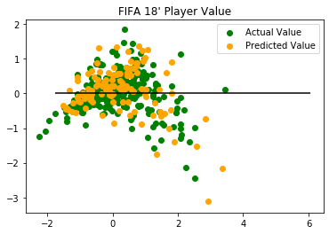
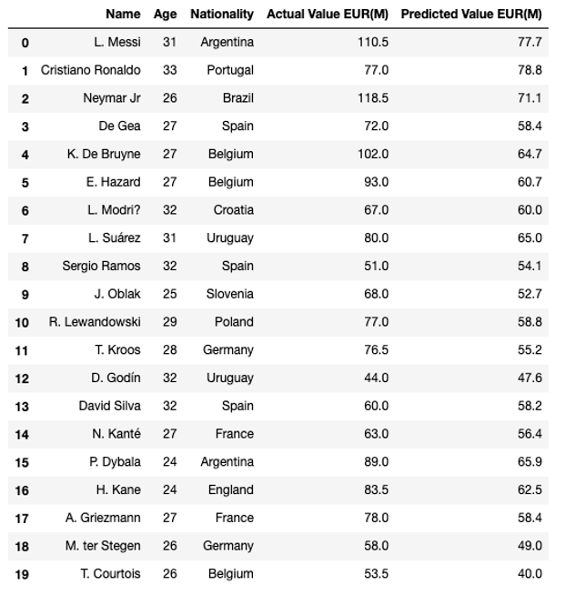

# **FIFA 2018 Player Values**

Machine Learning Algorithims were Used to Predict Player Value in Euros.

What are the Most Significant Factors of Player Value? What should Team Owners Consider when Determining a Player's Salary?

Author: Esaa Yamini

# **Machine Learning Process**

Given a Dataset of FIFA Player Attributes (Derived from FIFA 18 Video Game - EA Sports), Player Values were Predicted.

Machine Learning Algorithums of Linear Regression and Random Forest Regression were Used.

Attributes with the Most Impact on Player Value were Ordered by Significance. The Results were: AGE – POTENTIAL – FINISHING – REACTIONS – DRIBBLING – BALL CONTROL – LONG SHOTS – VOLLEYS – VISION
  
These Attributes were Used to Predict Each Player's Value using a SKLEARN Test/Train Model.

Actual Player Values and Predicted Player Values were Depicted Using Matplotlib. 

# **Analysis**

When Determining Player Value, the Two Most Important Questions Are; How Old is Player?, and How Does Player Rate ‘Potential’?  

These two Factors Played the Largest Role in Player’s Value.  	 

Ideal Age is Between 25 and 32.  

Player Potential, Finishing, Reactions, Dribbling, Ball Control, Long Shots, Volleys, and Vision (in that order of priority) Play the Most Significant Roles Within the Dataset when Determining a Player’s Value.  

# **Machine Learning Predictions:** 

